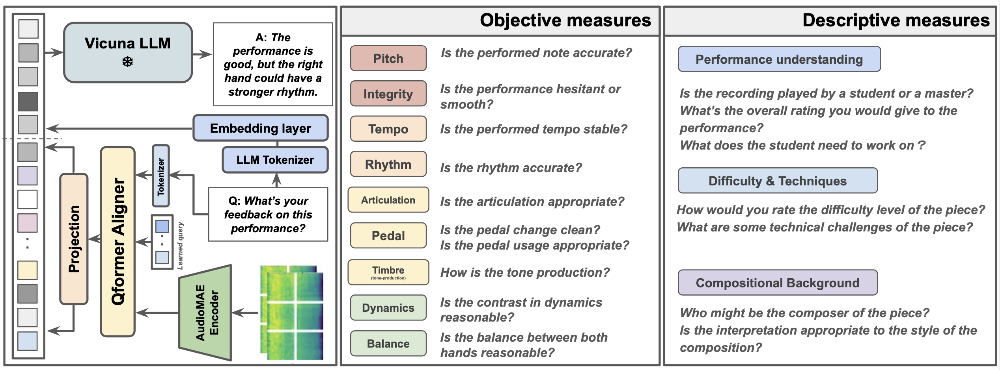

# LLaQo: Towards a query-based coach in expressive performance assessment
[](https://arxiv.org/pdf/2409.08795) [](https://huggingface.co/datasets/anusfoil/NeuroPiano-data) 

This is the repository of LLaQo, a Large Language Query-based music coach that leverages audio language modeling to provide detailed and formative assessments of music performances. 



### Environment

Our environment lam2 is downloadable from [here](https://huggingface.co/anusfoil/LLaQo-ckpts). After downloading, simply do ```source /path/to/your/envs/lam2/bin/activate ```.  Or install via pip with ```requirement.txt``` or conda with ```environment.yaml```.

checkpoints: please access from [here](https://huggingface.co/anusfoil/LLaQo-ckpts). It contains: Vicuna-7b model; Our checkpoint; and audio encoder. 


### Inference

For the gradio inference demo, after setting up the environment and put the ```ckpts/``` under root directory, please do:
```
python LLaQo-chat.py 
```

### Datasets

For our new NeuroPiano-dataset, please refer to the [hf repository](https://huggingface.co/datasets/anusfoil/NeuroPiano-data) as well as its [analysis report](). For other datasets, please see the following table for accessing audio data from their original place and our metadata file which contains the instruction-tuned QA. Additionally the ```qagen/``` directory contains processing prompts for CROCUS and expert_novice.

| dataset                       | audio                                                                    | metadata |
|-------------------------------|--------------------------------------------------------------------------|----------|
| Expert-Novice                 | https://zenodo.org/records/8392772                                       |  [metadatas/expert_novice/evaluation_qa.csv](metadatas/expert_novice/evaluation_qa.csv)        |
| CROCUS-piano                  | https://masaki-cb.github.io/crocus/ (need request)                       |  [metadatas/crocus/evaluation_qa.csv](metadatas/crocus/evaluation_qa.csv)        |
| Con Espressione               | https://zenodo.org/records/3968828                                       |  [metadatas/con_espressione/audio_qa.csv](metadatas/con_espressione/audio_qa.csv)        |
| Expressive Musical Gestures | http://gitlab.doc.gold.ac.uk/expressive-musical-gestures/dataset         |  [metadatas/expressive_musical_gestures/audio_qa.csv](metadatas/expressive_musical_gestures/audio_qa.csv)        |
| Burgmuller                    | https://sites.google.com/view/ismir2023-conspicuous-error (need request) |  [metadatas/Burgmuller/audio_qa.csv](metadatas/Burgmuller/audio_qa.csv)        |
| Music Shape Dataset           | https://zenodo.org/records/8021695 (need request)                        | [metadatas/music_shape_dataset/audio_qa.csv](metadatas/music_shape_dataset/audio_qa.csv)         |
| PISA                          | https://github.com/ParitoshParmar/Piano-Skills-Assessment                |  [metadatas/PISA/Annotations_v2.csv](metadatas/PISA/Annotations_v2.csv)        |
| YCU-PPE                       | https://ieeexplore.ieee.org/document/9361233 (need request)              | [metadatas/YCU-PPE-III/audio_qa.csv](metadatas/YCU-PPE-III/audio_qa.csv)         |
| PLD-asessment                     | http://river-blackberry-7de.notion.site                                  |  [metadatas/PianoJudge/audio_qa.csv](metadatas/PianoJudge/audio_qa.csv)        |
| PLD-technique                     | http://river-blackberry-7de.notion.site                                  |  [metadatas/techniques/audio_qa.csv](metadatas/techniques/audio_qa.csv)        |
| CIPI                          | https://zenodo.org/records/8037327 (audio fetched by PLD)                | [metadatas/difficulty_cipi/audio_qa.csv](metadatas/difficulty_cipi/audio_qa.csv)         |
| NeuroPiano                    | https://huggingface.co/datasets/anusfoil/NeuroPiano-data                 |          |


#### Acknowledgement

The codebase is adapted from the codebase of [APT](https://arxiv.org/abs/2312.00249), which was originally adapted from the BLIP-2, and the [lavis codebase](https://github.com/salesforce/LAVIS).  


#### Citaiton
```
@article{zhang2024llaqoassessment,
  title={{LLaQo: Towards a query-based coach in expressive performance assessment}},
  author={Zhang, Huan and Cheung, Vincent and Nishioka, Hayato and Dixon, Simon and Furuya, Shinichi},
  journal={arXiv preprint arXiv:2409.08795},
  year={2024}
}
```

